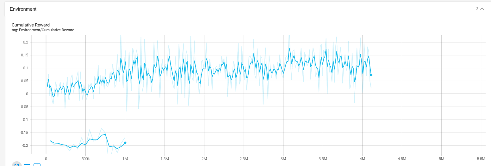
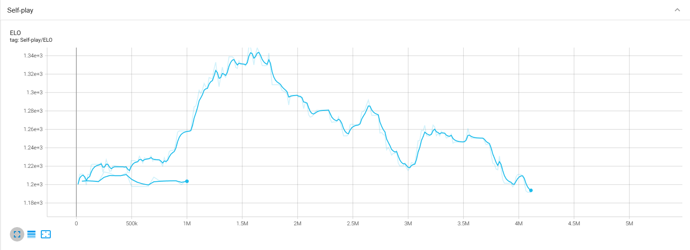

# Cursed Tennis

## Inleiding

In dit spel is het de bedoeling dat je een spelletje tennis speelt tegen een AI-agent die speciaal getraind is om te winnen tegen zijn tegenstander. Het spel wordt gespeeld in Virtual Reality en volgt uiteraard de echte regels van tennis.

### Speltitel

De naam van het spel is "Cursed Tennis". In dit spel sta je namelijk tegenover een vervloekt tennisracket.

### Gebruikte methoden

Voor dit project maken we gebruik van Anaconda om de AI-agents te trainen. Voor het ontwikkelen van de omgeving gebruiken we Unity. Daarnaast maken we gebruik van TensorBoard om de trainingsresultaten op een overzichtelijke manier weer te geven en een goed overzicht te krijgen van hoe de agent traint.

## Tutorial

Hieronder vind je een uitgebreide tutorial waarin stap voor stap wordt uitgelegd hoe je de code van het spel kunt implementeren, de spelomgeving kunt opzetten en de AI-agent kunt trainen. Na het doorlopen van deze tutorial ben je vertrouwd met het werken met ML-agents, Unity en VR. Je zult in staat zijn om je eigen tenniservaring in VR te creëren en te verbeteren.

### Installatie

Hieronder vind je een oplijsting van welke versies van de software we gebruiken:

- Unity: versie 2021.3
- Anaconda (Python): versie 3.9.13

De installaties van deze zaken vind je allemaal goed gedocumenteerd online.

### Opzetten omgeving

Hieronder een beknopte uitleg over hoe je de omgeving kan implementeren en de agent vervolgens kan trainen.

1. Je begint met het pullen de Github repo op je eigen omgeving. Dit kan met behulp van Github Desktop of andere Git GUI tools of met behulp van het volgende commando:

```
git clone https://github.com/AP-IT-GH/eindproject-QuintenNelen.git
```

2. Vervolgens open je de Untiy hub en klik je op "Open project". Je navigeert vervolgens naar de map waarin je de repo gepulled hebt en je kiest de repo als project. Nu zou je zonder problemen het project op moeten kunnen starten.
3. Vanuit het projectvenster van Unity navigeer je binnen de mappenstructuur naar de map "/Assets/Tennis/Scenes" en open je de tennis scene. Met behulp van deze scene kan je de agent gaan trainen. Deze scene is gemaakt om de agent te trainen met behulp van self play, waarin er 2 agents het tegen elkaar opnemen in een potje tennis.

Met dit achter de rug kan je dus nu aan het trainen beginnen.

### Trainen agent

In dit stappenplan wordt beknopt uitgelegd hoe je de agent kan trainen met behulp van Anaconda, ervan uitgaande dat je Anaconda hebt geïnstalleerd.

1. Maak een nieuwe conda environment met behulp van de volgende commando's:

```
conda create --name env_name
conda activate env_name
```

2. Installeer de benodigde packages om het trainen te laten werken. Hiervoor voer je de volgende commando's in:

```
pip3 install torch~=1.7.1 -f https://download.pytorch.org/whl/torch_stable.html
python -m pip install mlagents==0.30.0
```

3. Navigeer vervolgens vanuit Anaconda naar de map waar de "mlagents-learn" executable staat en voer het volgende commando uit voor de training te laten starten (Vervang `path/to/config.yaml` door het pad naar de YAML-configuratie van de Unity environment en `name_of_run` door de naam van de run):

```
mlagents-learn path/to/config.yaml --run-id=name_of_run
```

4. Je kan nadien op TensorBoard je resultaten gaan bekijken. Om TensorBoard te starten moet je het volgende commando uitvoeren (Vervang `path/to/runs` door het pad naar de map waarin de training runs worden opgeslagen.):

```
tensorboard --logdir=path/to/runs
```

5. De training wordt stop gezet als deze voltooid is of als je op `Ctrl+C` drukt.
6. Deactiveer de conda environment met het volgende commando:

```
conda deactivate
```

### Verloop spel

Je begint het spel in het hoofdmenu waar je, in VR uiteraard, enkele opties krijgt zoals het selecteren van het aantal sets. Als je het spel start kom je terecht in een stadion waar het spelletje tennis tegen de AI direct begint. De opslager van de bal wordt willekeurig gekozen. Je zal het spel ook kunnen pauzeren. Nadat alle sets gespeeld zijn, zal de winnaar bekend zijn en zal het spel eindigen. Hierna kom je terug uit op het hoofdmenu.

### Beschrijving code

Voor het project te realiseren maken we gebruik van verschillende scriptjes. Hieronder een korte uitleg wat elk script doet:

- GroundContact.cs: wordt gebruikt op de bal om contact met de grond te detecteren.
- HitWall.cs: dit script wordt gebruikt om te detecteren of de bal buiten gaat en voor het bepalen van de rewards die de agent krijgt in het algemeen.
- TennisAgent.cs: zorgt ervoor dat de tennis agent correct werkt en dat de puntentelling op de juiste manier wordt weergegeven.
- TennisArea.cs: script om de hele scene deftig op te zetten. Zorgt voor het resetten van de bal onder andere.
- TennisMatchManager.cs: dit script staat in voor het goed verlopen van een tennismatch, met alle correcte regels.

 Alle scripts zijn te vinden in de repo in de map "Assets/Tennis/scripts"

## Resultaten

Voor de agent in orde te krijgen hebben we hem uiteraard veel moeten trainen. Hieronder zal je enkele trainingsresultaten vinden en enkele observaties en waarnemingen tijdens het trainen.

### Trainingsresultaten

In het begin van het trainen, trainende Agent A en B een grote tijd apart. Agent B heeft een langere tijd gekregen om te trainen en haalde betere resultaten. Hierdoor werd Agent B beter. Agent A haalde integenstelling minder goede resultaten en leerde minder goed bij. Het gevolg hiervan is dat Agent B alleen maar beter werd, maar niet leerde samenspelen. Hij leerde alleen maar om Agent A te verslaan.

We zien bij de tweede run dat de rewards lager liggen maar constanter is (minder pieken). Dit resulteert er in dat ze beter op elkaar zijn afgestemd en beter tegen elkaar kunnen spelen.



We zien bij self play dat het eerst goede resultaten haalt en daarna naar beneden gaat. Hier zien we die pieken ook terug komen.

Bij de tweede run zie je dat die een constanter resultaat haalt. Waardoor dit brein beter was om samen te spelen.



### Observaties

De agent krijgt als observaties de positie van de bal mee, zijn eigen positie en positie naar waar de bal moet geschoten worden. Als de bal bij de agent is zal deze de bal terug slaan.

De agent krijgt een reward als die de bal heeft geraakt of een punt heeft gescoord. De agent krijgt meer reward als hij heeft gescoord dan wanneer hij een bal heeft geraakt.

## Conclusie

Hieronder een conclusie van wat we hebben gedaan en geleerd door het maken van dit project.

### Kort overzicht project

Zoals hierboven vermeld hebben we een spel gemaakt waarin je een potje tennis speelt tegen een getrainde AI agent. Uit de trainingsresultaten kunnen we concluderen dat we de agent zeer lang hebben moeten laten trainen voordat hij deftig kon tennissen. Ook zien we betere resultaten als naargelang er meer observations toegevoegd worden.

### Ervaringen

We hebben dit project goed ervaren en hebben er veel uit geleerd. Het trainen van de agent was soms wel een pijnlijk gegeven maar dit is uiteindelijk wel goed gekomen.

### Lessons learned/verbeteringen

- De agent lang genoeg laten trainen.
- Altijd controleren of er wel met de collision boxes ge-collide kan worden.
- Voldoende observations toevoegen.

## Bronvermelding

Unity-Technologies. (2023).  *GitHub - Unity-Technologies/ml-agents at fix-batch-tennis* . GitHub. https://github.com/Unity-Technologies/ml-agents/tree/fix-batch-tennis
